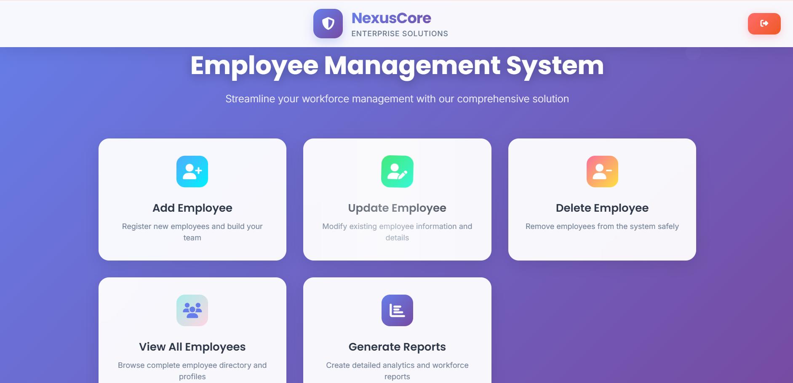
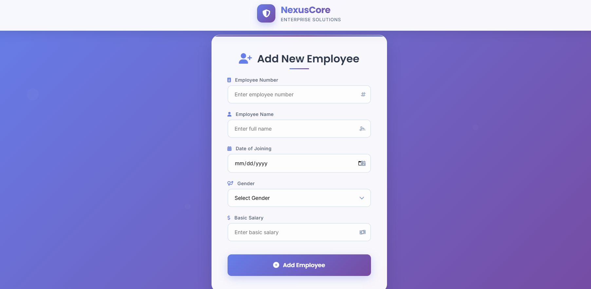
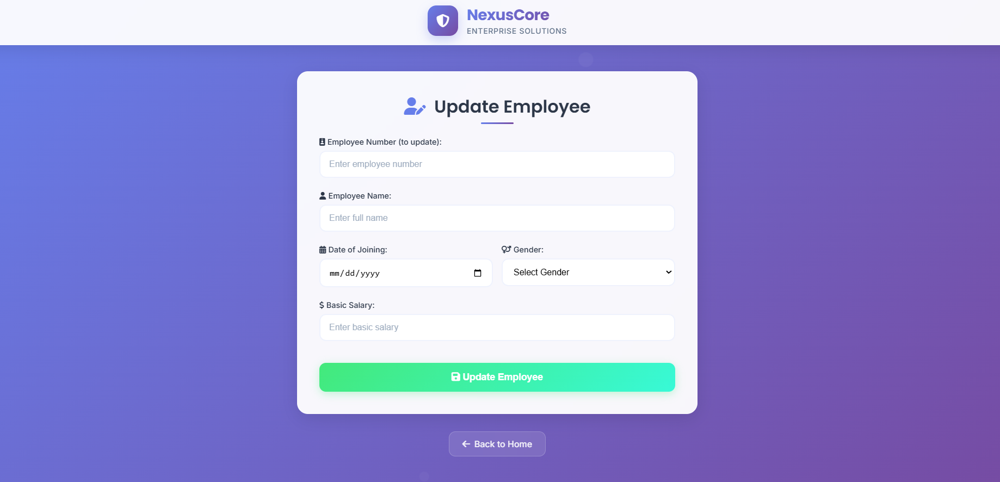
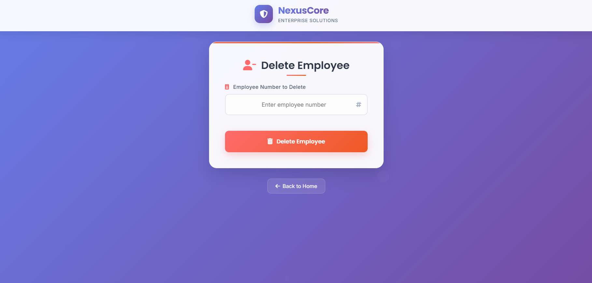

# **Employee Salary Management System**

**Subject Name**: Advanced Java  
**Subject Code**: BCS613D  
**Name**: Karthikeya J.S.
**USN**: 4AL22CS072
**Sem/Section**: VI/B

A comprehensive web application for managing employee salary records, payroll processing, and financial reporting built with JSP, Servlets, and MySQL following MVC architecture principles.

## 🚀 Features

* **Employee Management**: Complete CRUD operations for employee records
* **Salary Calculation**: Automated salary computation with allowances and deductions
* **Payroll Processing**: Generate monthly payrolls and salary slips
* **Department Management**: Organize employees by departments and designations
* **Advanced Search**: Search employees by ID, name, department, or designation
* **Comprehensive Reports**: Generate various reports including:
   * Monthly salary reports
   * Department-wise salary analysis
   * Employee salary history
   * Tax deduction reports
   * Bonus and incentive tracking
   * Highest/Lowest paid employees
* **Salary Components**: Manage basic salary, allowances, and deductions
* **Tax Calculation**: Automatic tax computation based on salary brackets
* **Input Validation**: Client-side and server-side validation
* **Professional UI**: Bootstrap-based responsive design
* **MVC Architecture**: Clean separation of concerns
* **Database Integration**: MySQL with JDBC connectivity
* **Role-based Access**: Different access levels for HR and administrators

## 📋 Prerequisites

Before running this application, make sure you have the following installed:

* **Java Development Kit (JDK) 8 or higher**
* **Apache Tomcat 9.0 or higher**
* **MySQL Server 5.7 or XAMPP Server**
* **MySQL JDBC Driver (mysql-connector-java)**
* **IDE**: Eclipse (J2EE), IntelliJ IDEA, or any Java IDE
* **Web Browser**: Chrome, Firefox, or Edge

## 🛠️ Project Structure

```
EmployeeSalaryManagementApp/
├── src/
│   ├── dao/
│   │   ├── EmployeeDAO.java
│   ├── model/
│   │   ├── Employee.java
│   ├── servlet/
│   │   ├── AddEmployeeServlet.java
│   │   ├── DeleteEmployeeServlet.java
│   │   ├── DisplayEmployeeServlet.java
│   │   ├── UpdateEmployeeServlet.java
│   │   ├── ReportServlet.java
│   │   └── ReportCriteriaServlet.java
├── WebContent/
│   ├── index.jsp
│   ├── employeeadd.jsp
│   ├── employeedelete.jsp
│   ├── employeeupdate.jsp
│   ├── employeedisplay.jsp
│   ├── reports.jsp
│   ├── report_form.jsp
│   ├── report_result.jsp
├── WEB-INF/
    └── web.xml
```

## 🗄️ Database Setup

### 1. Create Database

```sql
CREATE DATABASE IF NOT EXISTS employee_db;
USE employee_db;
```

### 2. Create Tables

```sql
-- Employee Table
CREATE TABLE Employee (
    EmpNo INT PRIMARY KEY,
    EmpName VARCHAR(100),
    DoJ DATE,
    Gender ENUM('Male', 'Female', 'Other'),
    Bsalary DECIMAL(10, 2)
);


### 3. Insert Sample Data

```sql
-- Sample Employees
INSERT INTO Employee (EmpNo, EmpName, DoJ, Gender, Bsalary) VALUES
(101, 'Alice Johnson', '2020-01-15', 'Female', 55000.00),
(102, 'Bob Smith', '2019-03-22', 'Male', 60000.00),
(103, 'Charlie Davis', '2021-07-01', 'Other', 48000.00),
(104, 'David Kim', '2018-11-30', 'Male', 72000.00),
(105, 'Eva Brown', '2022-05-10', 'Female', 50000.00),
(106, 'Frank Moore', '2023-02-18', 'Male', 53000.00),
(107, 'Grace Lee', '2020-09-05', 'Female', 58000.00),
(108, 'Hannah Wilson', '2019-12-12', 'Female', 61000.00),
(109, 'Ian Thomas', '2021-03-30', 'Male', 47000.00),
(110, 'Jackie Chan', '2024-04-01', 'Male', 65000.00);

```

## ⚙️ Installation & Setup

### Step 1: Clone/Download the Project
Download all the project files and organize them according to the project structure above.

### Step 2: Database Configuration
1. Start your MySQL server
2. Run the database setup scripts provided above
3. Update database credentials in `DatabaseUtil.java`:

```java
public class DatabaseUtil {
    private static final String URL = "jdbc:mysql://localhost:3306/employee_db";
    private static final String USERNAME = "root";
    private static final String PASSWORD = "";
    
    public static Connection getConnection() throws SQLException {
        return DriverManager.getConnection(URL, USERNAME, PASSWORD);
    }
}
```

### Step 3: Add MySQL JDBC Driver
1. Download MySQL Connector/J from the official MySQL website
2. Add the JAR file to your project's `WEB-INF/lib` directory
3. If using an IDE, add it to your build path

### Step 4: Deploy to Tomcat
1. Create a new Dynamic Web Project in your IDE
2. Copy all source files to the appropriate folders
3. Deploy the project to Tomcat server
4. Start the Tomcat server

### Step 5: Access the Application
Open your web browser and navigate to:
```
http://localhost:8080/EmployeeSalaryManagementApp/
```

## 💼 Application Modules

### Employee Management
- Add new employees with complete personal and professional details
- Update employee information and status
- View employee profiles and organizational hierarchy
- Search employees by various criteria
- Manage employee departments and designations

### Salary Structure Management
- Define salary components (basic, allowances, deductions)
- Set up salary structures for different designations
- Update salary revisions with effective dates
- Calculate gross and net salary automatically
- Manage tax brackets and deductions

### Payroll Processing
- Generate monthly payroll for all employees
- Process individual salary calculations
- Handle attendance-based salary computation
- Generate salary slips in PDF format
- Track payroll approval workflow

### Department Management
- Create and manage departments
- Assign department heads and locations
- View department-wise salary summaries
- Analyze department costs and budgets

### Reports & Analytics
- Monthly salary reports
- Department-wise salary analysis
- Employee salary history and trends
- Tax deduction summaries
- Bonus and incentive tracking
- Comparative salary analysis
- Payroll cost analysis
- Employee turnover reports

### Attendance Integration
- Track daily attendance for payroll calculation
- Handle overtime calculations
- Manage leave adjustments
- Generate attendance reports

## 📸 Screenshots

### Dashboard

*Main dashboard showing all features of the system.*

### Employee Management

*Employee registration form with comprehensive details*


*Employee updation form for easily modifying employee details.*

### Salary Structure

*Employee deletion form to delete employee form database.*


## 🔧 Configuration

### Database Connection Properties
Update the following properties in `DatabaseUtil.java`:
- **Database URL**: `jdbc:mysql://localhost:3306/employee_salary_management`
- **Username**: Your MySQL username
- **Password**: Your MySQL password

### Salary Calculation Settings
Configure in `SalaryCalculator.java`:
- **PF Rate**: 12% of basic salary
- **ESI Rate**: 1.75% of gross salary (if gross <= 25000)
- **Professional Tax**: State-specific rates
- **Income Tax**: As per current tax slabs

### Server Configuration
- **Default Port**: 8080
- **Context Path**: `/EmployeeSalaryManagementApp`
- **Session Timeout**: 30 minutes

## 📱 Usage

1. **Employee Registration**: Add new employees with complete salary structure
2. **Salary Setup**: Configure salary components and tax calculations
3. **Payroll Processing**: Generate monthly payroll with attendance integration
4. **Salary Slips**: Generate and distribute individual salary slips
5. **Reports**: Analyze salary trends and generate compliance reports
6. **Department Management**: Organize employees and track department costs

## 🔐 Security Features

- Input validation and sanitization
- SQL injection prevention
- Session management
- Role-based access control
- Secure salary data handling
- Audit trail for salary changes

## 🤝 Contributing

1. Fork the project
2. Create your feature branch (`git checkout -b feature/AmazingFeature`)
3. Commit your changes (`git commit -m 'Add some AmazingFeature'`)
4. Push to the branch (`git push origin feature/AmazingFeature`)
5. Open a Pull Request

## 📝 License

This project is licensed under the MIT License - see the LICENSE file for details.

## 📞 Contact

**Samay Shetty**  
- Email: prakhyatshetty710@gmail.com 
- USN: 4AL22CS142

## 🙏 Acknowledgments

- Thanks to the Advanced Java course instructors
- Bootstrap for the responsive UI framework
- MySQL for the robust database system
- Apache Tomcat for the web server
- iText library for PDF generation (salary slips)
